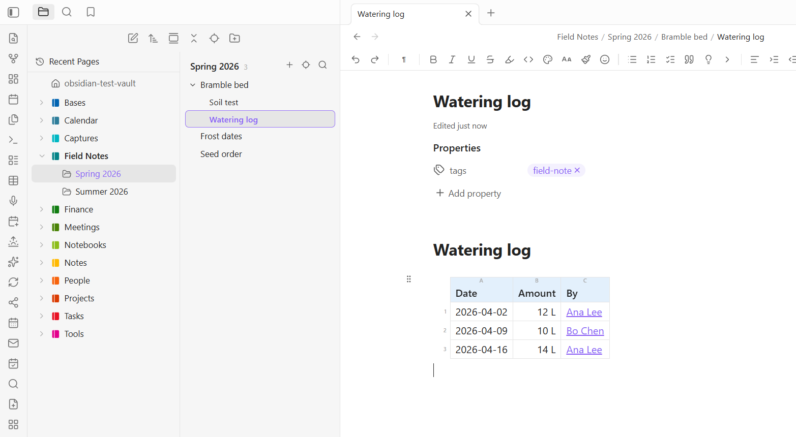

# Power Explorer

Drag your files and folders into exactly the order you want, and the order sticks. Then find anything in your vault the moment you start typing.

Built to stay fast in vaults with 20,000 notes and more.



## Ordering your files

- **Drag an item and drop it between two others** to set its position. A line shows where it will land.
- **Drop onto the middle of a folder** to move the item into it.
- New files keep Obsidian's own sort and appear at the bottom of folders you have arranged, or the top if you prefer.
- Right-click a folder for **Reset manual order**. Folders you never arranged are left completely alone.

**Cut and paste** handles the moves dragging is bad at. Cut a selection, take as long as you like finding the destination, then paste it into a folder or at a spot in another list. Escape calls it off and nothing has moved.

### Why it stays fast

Other manual-sort plugins fight the file explorer's DOM, with drag libraries per folder and observers watching the whole tree. That falls over somewhere past 10,000 notes. Power Explorer hooks the sort itself instead: Obsidian keeps drawing everything, and this only changes the order handed back for each folder on screen. There are no timers, no observers, and no per-item listeners, so it costs nothing at all until you actually drag something.

## A two-pane layout

Pick anything but **Obsidian default** in the **Desktop layout** setting and the Files pane splits in place: folders on the left, the pages of the selected folder on the right. Click a folder to see its pages, click a page to open it. Set it back and the stock pane returns exactly as it was.

Four layouts to choose from:

- **Full folder tree**: the native tree, exactly as before.
- **Notebooks only**: just your top-level folders on the left, everything else on the right.
- **Notebooks and sections**: the left pane goes exactly one folder deep. Anything deeper lives on the right.
- **Drill**: one level at a time, the phone layout with desktop-sized rows.

Arrow keys and Enter move through and open pages. Ctrl-click and Shift-click select several at once, and a right-click offers bulk open, pin, and delete. Dragging any row of a selection carries the whole thing.

### Page groups

A folder holding a note of the same name is drawn as **one row**, with the other notes indented under a chevron, like subpages under a parent page. It is the shape a notebook import produces naturally, and it reads the way you would expect instead of showing a folder sitting next to a duplicate note.

Rename either half and the other follows, so the pairing never dissolves by accident. A folder with no such note can gain one from its right-click menu, **Turn into a page**, or in bulk across a whole vault.

Drop pages onto a plain page and it becomes a group, with its new folder made *beside* the note so nothing is renamed or re-linked.

### Recent Pages

A pinned **Recent Pages** entry sits above the tree. Click it for your last 30 notes, newest first, each labeled with its section. It survives restarts, follows renames, and drops deleted files. Clicking through it does not yank you around the tree.

### Section colors

Right-click a folder for **Section color**, an accent bar in a curated palette that reads well in light and dark. Top-level folders get their whole cover colored instead.

### Other conveniences

- **Reveal active page**: the crosshair button jumps to the note you are editing, expanding whatever it takes to get there and flashing the row.
- **One tab per page**: clicking a page steps to the tab it is already open in, rather than opening a second copy with its own scroll position and undo history. Right-click for **Open in new tab** when you do want two.
- **The explorer toolbar** is yours to configure: add any command, hide the ones you never use, and drag them into order. Obsidian's own buttons are in the list too.
- **Hide folder** tucks attachment dumps and archives out of the tree. Peek at them any time with the eye button; showing is per session, so a peek never quietly becomes permanent.

### On phones

The layout becomes drill navigation: one screen at a time, with big tappable rows, a back row at the top, and a long press for the full menu. Tablets keep the two-pane layout, and nothing changes on desktop by default.

## Page templates

Right-click a folder and choose **Set page template** to point it at a note. Every new page in that folder then starts as a copy of it. Templates are inherited, so setting one on a notebook covers everything under it.

A template is configured by its own properties, none of which end up in the pages it makes:

| Property | What it does |
| --- | --- |
| `icon` | The gallery card's icon: an emoji, a Lucide icon name, or a vault image. |
| `description` | The one-line blurb under the card's title. |
| `filename` | What to name the pages it makes. |
| `folders` | Which folders it belongs to. Subfolders count. |
| `destination` | One folder to file its pages in, wherever you pressed **+**. |
| `unique` | `day` opens today's page instead of making a second one. |
| `ask` | Whether to ask this template's questions. |

Every template also gets its own command, so the ones you use daily can take a hotkey.

### Naming pages

Give a template a `filename` and its pages arrive named. `{{date}} {{name:Meeting Name}}` makes `2026-07-28 Meeting Name` and opens it with just the generic part selected, so you type over it and the date stays put.

| Token | Gives |
| --- | --- |
| `{{date}}`, `{{date:YYYY-MM}}` | Today, in the format you ask for. |
| `{{date+1d}}`, `{{date-1w:dddd}}` | Shifted by day, week, month, or year. |
| `{{time}}`, `{{time:HH-mm}}` | The time now. |
| `{{name:Text}}` | The generic part, preselected when the page opens. |
| `{{cursor}}` | Where to leave the cursor. |
| `{{ask:Question}}` | Asked in a dialog before the page is made. |
| `{{rollover}}` | Unfinished tasks from the previous dated page. |
| `{{folder}}`, `{{parent}}`, `{{vault}}` | Where the page is being made. |

Date offsets are what make a daily note navigable: `← [[{{date-1d}}]]` links yesterday without you having to know what yesterday was. And `{{rollover}}` pulls the unchecked tasks from the most recent earlier page, so Monday collects Friday's leftovers rather than an empty weekend. It only ever reads that page; nothing edits a note you are not looking at.

## Search everywhere

Click the **ribbon search icon** or run **Search everywhere**, and just type. Results appear as you type, every word has to match, and matching is by word prefix, so "budg" finds budget, budgets, and budgeting. Nothing fuzzy, so a result always visibly contains what you typed. Put "quotes" around words to require an exact phrase.

Ranking follows your spatial memory: title matches first, then a lift for your recent pages, pinned notes, and the section you are browsing. Results group under notebook and section headers so you recognize a hit by where it lives. Enter opens it, Ctrl+Enter opens a new tab, and Tab cycles the scope between everywhere, this notebook, and this section.

**Open a result and your search terms are highlighted right in the note**, scrolled to the nearest match, so you land on the passage rather than just the page. The highlight fades on its own.

Matches cover titles, aliases, headings, body text, tags, and folder names. The index builds in the background on first launch and keeps itself current as you work.

- **PDFs**: turn on **Search PDF text** and a hit opens the file at the right page.
- **Screenshots**: turn on **Search image text** and install [Power Extract](https://github.com/obsidian-power-plugins/power-extract), and the words inside your images become searchable. A hit opens the note that embeds the image, scrolled to it.
- **Ask AI**: with [Power Assistant](https://github.com/obsidian-power-plugins/obsidian-power-assistant) installed, a chip in the search box answers questions from your own notes with clickable citations, using this same index.

The pages pane's filter box searches inside notes too, scoped to the section you are looking at.

## Hiding what you do not want to look at

Right-click any folder to hide it from the tree. **Hide attachments** does the same for PDFs, images, and documents, which matters if you file a note's own papers beside the note: the folder holding six pages and nine PDFs reads as six pages again. Notes, canvases, and Bases always stay, and the files themselves never move.

Neither is a one-way door. The eye button in the pages pane shows everything again for as long as you need it, and tucks it back when you are done.

## Settings

Drag to reorder (with a command for the hotkey), where unarranged items go, hiding attachments, clear all stored orders, the search index and modal, PDF text, image text, and folders search should skip.

## Coming from another notebook app

The [Migration Toolkit](https://github.com/obsidian-power-plugins/onenote-to-obsidian) is a companion set of scripts for notebook imports. It repairs page and section names the official importer rejects, cleans up importer artifacts in the Markdown afterwards, and restores the notebook, section, and page order the importer drops, writing it straight into Power Explorer's own ordering.

Imported notebooks are also where page groups come from: a page with subpages arrives looking like one.

## Compatibility notes

- Turn off other sorting plugins (Manual Sorting, Custom File Explorer sorting, Bartender) while using this one. Two plugins overriding the same sort will fight.
- The manual order lives in the plugin's settings and travels wherever your community plugin folders sync.
- If a future Obsidian version changes its ordering internals, the explorer falls back to its default sort rather than breaking.

## What the catalog's scan reports

The community catalog scans a plugin for what it is *capable* of, which is not the same as what it does with it. Power Explorer reports two things.

| What the scan reports | What it is | Where |
| --- | --- | --- |
| **Vault enumeration** | Listing your files, which is what a file explorer is. Search builds and reconciles its index from it, the template pickers offer the notes in your templates folder, and the performance report counts what is there. Only paths, extensions, and modification times are looked at, and nothing leaves Obsidian. | [`src/main.ts`](src/main.ts) `templateNotes`, the search index |
| **Clipboard access** | Writing, never reading. One line: the performance report, as JSON, when you run the command that produces it. | [`src/main.ts`](src/main.ts), the performance report command |

Power Explorer makes no network requests of any kind: there is no `requestUrl`, no `fetch`, and no `XMLHttpRequest` anywhere in it. It starts no processes and reads no files outside your vault. There is no `eval`, no `Function` constructor, and no `innerHTML`.

## More Power Plugins

Each one works on its own, and they fit together when you have more than one.

- **[Power Assistant](https://github.com/obsidian-power-plugins/obsidian-power-assistant)**: record and summarize meetings, capture anything from a link, and ask your notes questions.
- **[Power Bases](https://github.com/obsidian-power-plugins/obsidian-power-bases)**: board, calendar, timeline, chart, and gallery views for Bases.
- **[Power Connect](https://github.com/obsidian-power-plugins/obsidian-power-connect)**: sync your vault through your own Dropbox, OneDrive, or Google Drive.
- **[Power Desk](https://github.com/obsidian-power-plugins/obsidian-power-desk)**: your calendars and your mail, inside your vault.
- **[Power Editor](https://github.com/obsidian-power-plugins/obsidian-power-editor)**: a formatting toolbar, drag-and-drop blocks, and WYSIWYG editing.
- **[Power Extract](https://github.com/obsidian-power-plugins/power-extract)**: reads the text inside images so you can search it.
- **[Power Tables](https://github.com/obsidian-power-plugins/obsidian-power-tables)**: colors, live formulas, and sorting for Markdown tables.

## Build from source

```
npm install
npm run build     # type-check + bundle main.js
npm test          # pure-logic unit tests (Node)
```

## Support

Power Explorer is built and maintained by one person. If it earns a place in your daily vault, you can [buy me a coffee](https://buymeacoffee.com/powerplugins). Nothing in the plugin is held back either way.

[](https://buymeacoffee.com/powerplugins)
